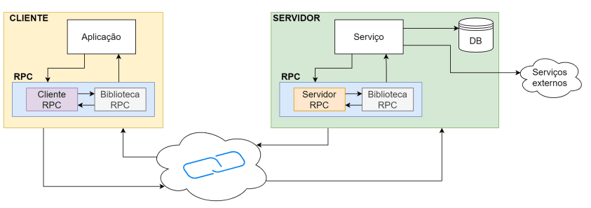
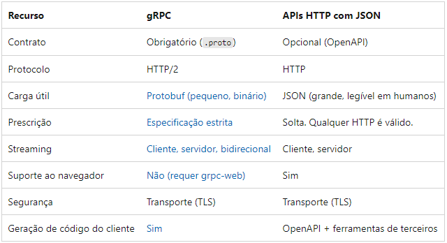

# Introdução ao uso do GRPC com Node.js

### Tecnologias utilizadas
- Node.js
- GRPC
- ProtoBuf3
 

	
  
 Exercicios Práticos 

  - [Client gRPC](https://github.com/gabybonini/gRPC-Node/GRPC-01)
  - [Chat gRPC](https://github.com/gabybonini/gRPC-Node/GRPC-02)
 
   

---

## gRPC 

 O gRPC é um framework que simplifica o sistema de mensagens entre clientes e serviços de back-end, utiliza e facilita a utilização do RPC, a ideia e ser mais performático do que a sua contraparte REST por ser baseado no HTTP/2 e utilizar uma linguagem de definição de Interfaces (IDL) conhecida como Protocol Buffers (protobuf). Este conjunto de ferramentas torna possível que o gRPC seja utilizado em diversas linguagens ao mesmo tempo com um overhead muito baixo enquanto continua sendo mais rápido e mais eficiente do que as demais arquiteturas de chamadas de rede.

---
### GRPC X REST 

#### 1. Protobuf em vez de JSON / XML
- Tanto as APIs REST quanto as APIs RPC enviam e recebem mensagens usando os formatos de mensagem JSON ou XML.
- Em contraste com REST, gRPC não tem problemas com velocidade e peso, oferecendo maior eficiência ao transmitir mensagens usando o formato Protobuf (buffers de protocolo).

#### 2. Construído em HTTP 2 em vez de HTTP 1.1
- As APIs REST geralmente são construídas em HTTP 1.1, que usa um modelo de comunicação de request-response. Isso significa que, quando um microsserviço recebe várias solicitações de mais de um cliente, ele precisa atendê-las uma de cada vez, de forma sequencial, o que torna todo o sistema mais lento.

- Já o gRPC usa HTTP 2 e aproveita seu suporte para comunicação bidirecional. Assim, quando um microsserviço recebe várias solicitações de mais de um cliente, ele alcança a multiplexação atendendo a muitas solicitações e respostas simultaneamente.

#### 3. Geração de código nativo em vez de usar ferramentas de terceiros
- Os recursos de geração de código são nativos do gRPC. Com APIs REST, é necessário usar uma ferramenta de terceiros, como `Swagger`, para gerar automaticamente o código para chamadas de API em várias linguagens.
O compilador protoc que acompanha o gRPC é compatível com uma ampla variedade de linguagens de programação. E isso o torna excelente para ambientes onde se está conectando vários microsserviços diferentes que são codificados em diferentes idiomas e executados em diferentes plataformas.

#### 4. Transmissão de mensagens 7 a 10 vezes mais rápida
- as conexões da API gRPC são mais rápidas do que as conexões da API REST.
Cerca de 7 vezes mais rápido do que REST ao receber dados e cerca de 10 vezes mais rápido ao enviar dados para carga específica.

#### 5. Implementação mais lenta do que REST
- A implementação da API gRPC é muito mais lenta do que a implementação da API REST.
Leva-se aproximadamente 45 minutos para implementar um serviço gRPC simples contra  cerca de apenas 10 minutos para implementar uma API REST.

---

### HTTP/2
o HTTP não pode enviar mais de uma requisição por vez para um servidor, ou então receber mais de uma resposta na mesma conexão, isso torna o HTTP/1.1 mais lento, já que ele precisa criar uma nova conexão para cada requisição.

No HTTP/2 temos o que é chamado de multiplexação, que consiste em poder justamente receber várias respostas e enviar várias chamadas em uma mesma conexão. Isto só é possível por conta da criação de um novo frame no pacote HTTP chamado de Binary Framing. Este frame essencialmente separa as duas partes (headers e payload) da mensagem em dois frames separados, porém contidos na mesma mensagem dentro de um encoding específico.

#### <h3> Compressão de headers </h3>
- Outro fator que transforma o HTTP/2 em um protocolo mais rápido é a compressão de headers. Em alguns casos os headers de uma chamada HTTP podem ser maiores do que o seu payload, por isso o HTTP/2 tem uma técnica chamada HPack. tudo na chamada é comprimido, inclusive os headers, isso ajuda na performance porque podemos trafegar os dados binários ao invés de texto. Além disso, o HTTP/2 mapeia os headers que vão e vem de cada lado da chamada, dessa forma é possível saber se os headers foram alterados ou se eles estão iguais aos da última chamada. Se os headers foram alterados, somente os headers alterados são enviados, e os que não foram alterados recebem um índice para o valor anterior do header, evitando que headers sejam enviados repetidamente.

---

### ProtoBuf
o Protocol Buffer (ProtoBuf) é um mecanismo extensível para a serialização de dados estruturados. É semlehante aos JSON e a ao XML, mas possui algumas vantagens em relação a esses, como ser mais rápido e menor. Essas vantagens tornam esse protocolo de estruturação de dados mais adequado para o uso dentro do gRPC, necessitando de menos rede e recursos computacionais para a sua manipulação e envio pela rede.

Outros recursos importantes são:

- Neutralidade na escola da plataforma, linguagem...
- Consumo de pouco espaço.

---
